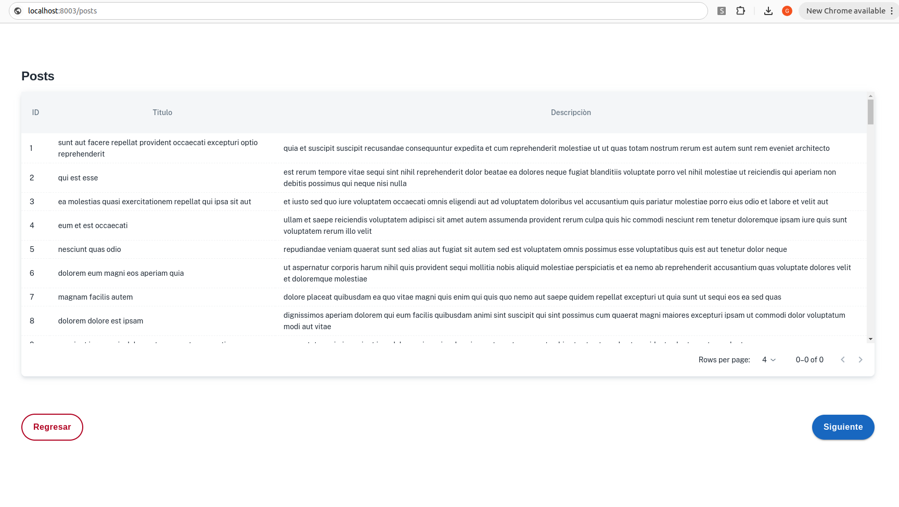
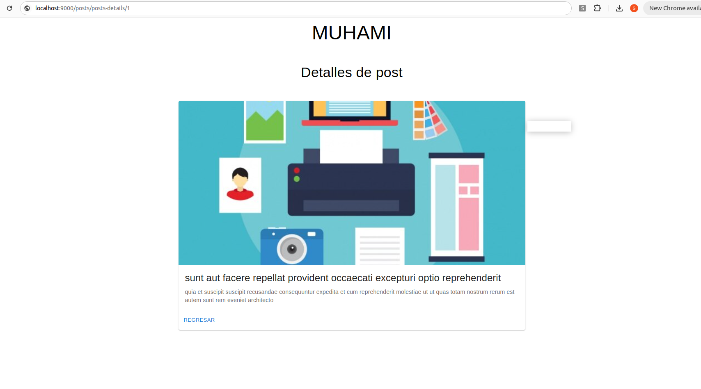

# Kode Vox practical exam 
## React + TypeScript + Vite

A continuacion se describen los puntos a desarrollar de la aplicaciòn demo.


- ### Crear el enrutador que contenga las siguientes rutas en el archivo router.tsx 
      - /dashboard
      - /posts  
      - /posts/posts-details/:id

- ### Cambiar de manera global los colores por default del tema de MUI por los colores correspondientes que biene en el archvio 
      colors.js
- ### Utilizar los componentes/tags de MUI(*https://mui.com/material-ui/all-components/*) par el diseño de las vistas/page 
    #### *Nota: Evita lo mas que puedas la etiquetas nativas de html*

- ### Utilizar typado de datos y elementos:
  - Cadenas de texto (strings)
  - Números (number)
  - Booleanos (true & false)
  - Arrays
  - Enumerados (enum)
  - object
  - Element
  - etc

- ### Utilizar los siguientes Hooks de ser posible:
    - useCallback
    - useContext
    - useEffect
    - useMemo
    - useRef
    - useState

- ### Utilizar ECMA 6 sintaxis de ser posible:
  - palabras clave let y const
  - Funciones de flecha
  - Cadenas multilínea
  - Parámetros predeterminados
  - Literales de plantilla
  - Tarea de desestructuración
  - Literales de objetos mejorados
  - Promesas


- ### Maqueta la siguiente tabla con el mismo diseño con la siguiente estructura y recursos :
  
  ```bash
  src
  ├── pages
  │   ├──postsPage.tsx
  │── components
  │   ├──table
          ├──tablePosts.tsx
          ├──tableCellBodyCustom.tsx
          ├──tableCellHeadCustom.tsx
          ├──tableRowCustom.tsx

  ```
  - postPage-> sobre la ruta   ```/posts```
  - Recurso/Endpoint: https://jsonplaceholder.typicode.com/posts
  - Implementar paginado(paginado de la data regresada del recurso) 


- ### Maqueta la siguiente vista con el mismo diseño con la siguiente estructura y recursos:
  
  ```bash
  src
  ├── pages
  │   ├──detailsPostPage.tsx
  │── components
  │   ├──cards
          ├──mediaCard.tsx

  ```
  - detailsPostPage-> sobre la ruta   ```/posts/posts-details/:id```
  - Recurso/Endpoint: https://jsonplaceholder.typicode.com/posts/:id
  - El ```:id``` lo obtendras desde la tabla as hacer click sobre algun registro deberas mandarte a la nuevas page y esta a su vez poder regresar a tabla
